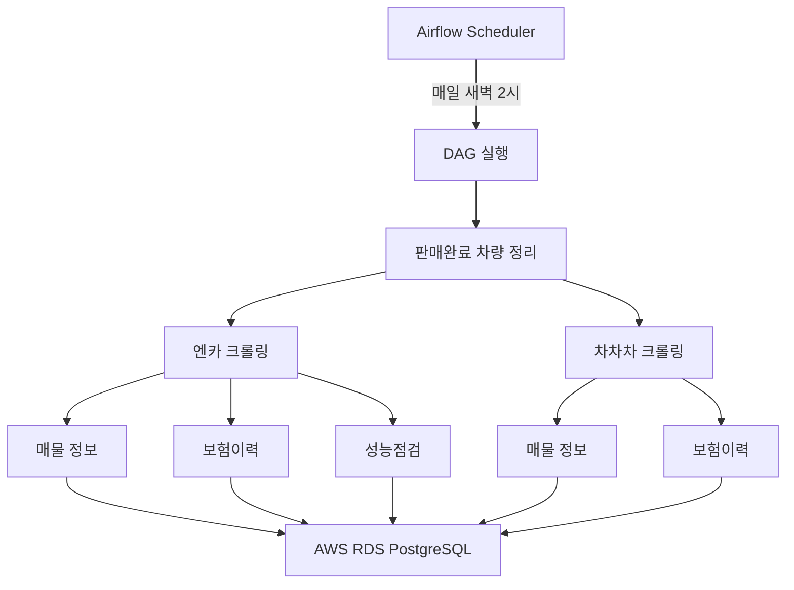

# 🚗 Car_Fin - 중고차 데이터 통합 크롤링 & 분석 플랫폼

중고차 매물 정보를 자동으로 수집하고 금융 상품 정보를 제공하는 데이터 파이프라인 시스템입니다.

## 📋 목차

- [프로젝트 개요](#-프로젝트-개요)
- [주요 기능](#-주요-기능)
- [기술 스택](#-기술-스택)
- [데이터 수집 플랫폼](#-데이터-수집-플랫폼)
- [데이터베이스 구조](#-데이터베이스-구조)
- [빠른 시작](#-빠른-시작)
- [프로젝트 구조](#-프로젝트-구조)

---

## 🎯 프로젝트 개요

**Car_Fin**은 국내 주요 중고차 플랫폼(엔카, KB 차차차)의 매물 정보와 차량 리뷰를 자동으로 수집하여 통합 데이터베이스를 구축하는 시스템입니다.

### 💡 핵심 가치

- **🔄 자동화**: Apache Airflow를 이용한 스케줄링으로 매일 자동 크롤링
- **📊 통합 데이터**: 다중 플랫폼의 데이터를 표준화된 스키마로 통합
- **🔍 상세 정보**: 차량 기본정보 + 옵션 + 보험이력 + 성능점검 + 리뷰
- **☁️ 클라우드 기반**: AWS RDS PostgreSQL을 이용한 안정적인 데이터 저장

---

## ✨ 주요 기능

### 1. 중고차 매물 크롤링

#### 엔카 (encar_crawler.py)
- ✅ 국산차/수입차 매물 정보 수집 (브랜드별, 모델그룹별)
- ✅ 차량 기본 정보: 가격, 주행거리, 연식, 색상 등
- ✅ 차량 옵션: 190개 이상의 공통 옵션 매핑
- ✅ **보험이력**: 사고이력, 특수용도, 소유자변경 등
- ✅ **성능점검서**: 엔진, 변속기, 외판/골격 상태 (100+ 항목)
- ✅ 판매완료 차량 자동 정리

#### KB 차차차 (chacha_crawler.py)
- ✅ 제조사별/클래스별 매물 정보 수집
- ✅ 차량 기본 정보 + 옵션
- ✅ **보험이력**: 네이버 SNS 로그인을 통한 인증 크롤링
- ✅ Selenium 헤드리스 모드 지원 (로봇 탐지 우회)
- ✅ 쿠키 자동 갱신 및 세션 관리

### 2. 차량 리뷰 수집

#### Getcha 리뷰 (getcha_crawler.py)
- ✅ 오너 리뷰 데이터 수집
- ✅ 평점 분석: 디자인, 성능, 옵션, 유지관리
- ✅ 제조사/모델별 사용자 의견 통계

### 3. 금융 상품 정보

#### 국민은행 자동차 대출 (finanace_crawler.py)
- ✅ 자동차 대출 상품 금리 정보
- ✅ 기준금리, 가산금리, 우대금리, 최저/최고금리

### 4. 자동화 스케줄링

- ✅ **Apache Airflow 3.1.0** 기반 DAG 실행
- ✅ 매일 새벽 2시 자동 크롤링
- ✅ 판매완료 차량 자동 정리 후 신규 매물 수집
- ✅ 6~8시간 타임아웃 (대규모 크롤링 대응)
- ✅ 3회 재시도 (30분 간격)

---

## 🛠️ 기술 스택

### Backend & Crawling
- **Python 3.13**: 최신 성능 최적화
- **Requests**: HTTP 요청 (Retry 로직 포함)
- **BeautifulSoup4**: HTML 파싱
- **Selenium 4**: 동적 페이지 크롤링 (헤드리스 Chrome)

### Database
- **PostgreSQL 13**: AWS RDS 호스팅
- **SQLAlchemy**: ORM (Object-Relational Mapping)
- **psycopg2**: PostgreSQL 어댑터

### Orchestration
- **Apache Airflow 3.1.0**: 워크플로우 관리
- **Docker Compose**: 컨테이너 오케스트레이션
- **LocalExecutor**: 로컬 태스크 실행

### Infrastructure
- **Docker**: 컨테이너화
- **Chrome/ChromeDriver**: Selenium 브라우저 자동화
- **AWS RDS**: 클라우드 데이터베이스

---

## 📡 데이터 수집 플랫폼

| 플랫폼 | 수집 데이터 | 특징 | 크롤러 |
|--------|-------------|------|--------|
| **엔카** | 차량 매물 + 보험이력 + 성능점검 | API 기반, 상세한 검사 정보 | `encar_crawler.py` |
| **KB 차차차** | 차량 매물 + 보험이력 | SNS 로그인 필요, Selenium 사용 | `chacha_crawler.py` |
| **Getcha** | 오너 리뷰 + 평점 | 사용자 경험 데이터 | `getcha_crawler.py` |
| **국민은행** | 자동차 대출 금리 | 금융 상품 정보 | `finanace_crawler.py` |

---

## 🗄️ 데이터베이스 구조

### 핵심 테이블

#### 1. `vehicles` - 차량 정보
```
차량 ID, 차량번호, 플랫폼, 제조사, 모델, 등급, 트림,
연료, 변속기, 배기량, 색상, 연식, 최초등록일,
주행거리, 가격, 신차가, 판매유형, 지역, 상세URL, 사진
```

#### 2. `option_masters` - 옵션 사전 (190+ 항목)
```
선루프, 네비게이션, 후방카메라, 차선이탈경고, 
어라운드뷰, 통풍시트, 열선시트, 스마트키 등
```

#### 3. `vehicle_options` - 차량별 옵션 매핑
```
차량 ID ↔ 옵션 ID 매핑
```

#### 4. `insurance_history` - 보험이력
```
사고횟수(내차/상대차), 사고금액, 전손, 도난, 침수,
소유자변경, 차량번호변경, 특수용도(렌터카/영업용/관용)
```

#### 5. `inspections` - 성능점검 요약
```
검사일, 유효기간, 검사주행거리, 사고이력, 침수, 화재,
튜닝, 리콜, 엔진상태, 변속기상태, 보증유형
```

#### 6. `inspection_details` - 성능점검 상세
```
검사 항목: 엔진, 변속기, 동력전달, 조향, 제동, 전기 등 (100+ 항목)
외판/골격: 프론트 범퍼, 보닛, 루프, 휀더 등 (교환/판금/흠집 등)
```

#### 7. `getcha_reviews` - 차량 리뷰
```
제조사, 모델, 등급, 연식, 가격,
평점(총점/디자인/성능/옵션/유지관리),
코멘트(항목별 사용자 의견)
```

---

## 🚀 빠른 시작

자세한 설정 방법은 [SETUP_GUIDE.md](./SETUP_GUIDE.md)를 참고하세요.

### 1. 환경 설정

```bash
# .env 파일 생성
cat > .env << EOF
# PostgreSQL 데이터베이스
DB_HOST=your-rds-endpoint.rds.amazonaws.com
DB_USER=your_username
DB_PASSWORD=your_password
DB_NAME=your_database
DB_PORT=5432

# 네이버 로그인 (차차차 보험이력용)
NAVER_ID=your_naver_id
NAVER_PASSWORD=your_naver_password

# Airflow 설정
AIRFLOW_UID=50000
_AIRFLOW_WWW_USER_USERNAME=admin
_AIRFLOW_WWW_USER_PASSWORD=admin123
AIRFLOW_FERNET_KEY=your-fernet-key
EOF
```

### 2. Docker Compose로 Airflow 실행

```bash
# 이미지 빌드 및 서비스 시작
docker-compose up -d --build

# 로그 확인
docker-compose logs -f airflow-scheduler
```

### 3. Airflow 웹 UI 접속

- URL: **http://localhost:8080**
- 사용자명: `admin` (또는 `.env`에서 설정한 값)
- 비밀번호: `admin123` (또는 `.env`에서 설정한 값)

### 4. DAG 실행

Airflow UI에서 `car_crawling_daily` DAG를 활성화하면 매일 새벽 2시에 자동 실행됩니다.

---

## 📁 프로젝트 구조

```
Car_Fin/
├── crawler/                    # 크롤러 모듈
│   ├── encar_crawler.py        # 엔카 크롤러 (매물 + 보험 + 검사)
│   ├── chacha_crawler.py       # KB 차차차 크롤러 (매물 + 보험)
│   ├── getcha_crawler.py       # Getcha 리뷰 크롤러
│   ├── finanace_crawler.py     # 국민은행 자동차 대출
│   ├── option_mapping.py       # 옵션 공통화 매핑
│   └── inspection_mapping.py   # 성능점검 데이터 정규화
│
├── db/                         # 데이터베이스 모듈
│   ├── connection.py           # DB 연결 및 세션 관리
│   └── model.py                # SQLAlchemy ORM 모델
│
├── dags/                       # Airflow DAG 정의
│   └── car_crawling_dag.py     # 중고차 크롤링 DAG (매일 새벽 2시)
│
├── docker-compose.yml          # Docker Compose 설정
├── Dockerfile                  # 커스텀 Airflow 이미지 (Python 3.13 + Chrome)
├── requirements.txt            # Python 패키지 의존성
├── .env                        # 환경변수 설정 (git에서 제외)
├── README.md                   # 프로젝트 개요 (이 파일)
└── SETUP_GUIDE.md              # 상세 설치 가이드
```

---

## 📊 데이터 흐름



---

## 🔍 주요 특징

### 1. 통합 옵션 매핑
- 플랫폼별 옵션 코드를 190개 이상의 공통 옵션으로 정규화
- 예: 엔카 `SUNROOF` + 차차차 `A001` → `SUNROOF` (선루프)

### 2. 성능점검 데이터 정규화
- 엔카/차차차의 다른 검사 항목을 공통 스키마로 변환
- INNER (검사 항목): 엔진, 변속기, 동력전달, 조향, 제동 등
- OUTER (외판/골격): 교환/판금/흠집/요철/부식/손상

### 3. 보험이력 통합
- 플랫폼별 다른 API 구조를 단일 테이블로 통합
- 사고이력, 특수용도, 소유자변경 등 핵심 정보 표준화

### 4. Selenium 자동화
- 헤드리스 Chrome으로 동적 페이지 처리
- 네이버 SNS 로그인 자동화 (KB 차차차 보험이력)
- 쿠키 자동 갱신 및 세션 관리
- 로봇 탐지 우회 (자동화 탐지 회피)

---

## 🔧 주요 트러블슈팅

프로젝트 개발 중 해결한 주요 문제들입니다.

### 1. KB 차차차 - 봇 탐지 우회

**문제:** 일부 페이지에서 이미지 URL을 가져오지 못함 (간이 페이지 응답)

**시도한 방법:**
- ❌ 딜레이 증가
- ❌ 재시도 2~3회
- △ 모바일 페이지 (일부 해결)
- ✅ **Selenium으로 로봇 체크 통과 후 쿠키 갱신**

**해결 방법:**
```python
# 이미지 URL이 없으면 Selenium으로 쿠키 재획득
if not image_url:
    cookies = get_cookies_from_selenium(car_seq)
    session = build_session()
    apply_cookies_to_session(session, cookies)
```

### 2. KB 차차차 - 250페이지 제한

**문제:** 차차차는 250페이지까지만 응답

**해결:** 브랜드별 → 클래스별 세분화 크롤링
- 250페이지 미만: 브랜드별 크롤링
- 250페이지 초과: 클래스별 세분화

### 3. KB 차차차 - 보험이력 세션 충돌

**문제:** 로봇 체크 쿠키 + 로그인 쿠키 충돌 → 차량 정보 또는 보험이력 누락

**해결:** 세션을 완전히 새로 생성하여 쿠키 충돌 방지
```python
# 기존 세션 버리고 새 세션 생성
session = build_session()
apply_cookies_to_session(session, selenium_cookies)
```

### 4. 엔카 - 중복 carSeq

**문제:** 여러 carSeq가 같은 차량을 가리킴 (Alias carSeq)

**해결:** 상세 API 응답의 실제 vehicleId로 대체
```python
real_vehicle_id = complete_info.get("vehicleId")
```

### 5. 엔카 - 멀티스레드 중복 체크 실패

**문제:** 병렬 크롤링 중 동일 차량번호를 중복 수집

**해결:** 크롤링 후 배치 단위로 중복 제거
```python
# DB 저장 전 최종 중복 제거
final_records = []
seen_in_batch = set()
for record in processed_records:
    if vehicle_no not in seen_in_batch:
        final_records.append(record)
        seen_in_batch.add(vehicle_no)
```

### 6. 엔카 - 판매완료 차량 정리

**문제:** 판매/삭제된 차량이 DB에 누적

**해결:** 크롤링 전 판매완료 차량 자동 정리
```python
def cleanup_sold_vehicles():
    # API 404 응답 시 cascade 삭제
    if not detail_info:
        _delete_vehicle_cascade(session, vehicle_id)
```

### 7. 옵션 매핑 일반화

**문제:** 플랫폼별 옵션 코드 불일치

**해결:**
- KB 차차차 전용: 14개
- 엔카 전용: 14개
- 공통 옵션: 59개
- **총 87개 옵션으로 표준화**

수작업으로 API 응답을 분석하여 매핑 테이블 구축

### 8. 성능점검 데이터 정규화

**가장 어려웠던 부분:**
- 항목 불일치 (엔카 vs 차차차)
- 데이터 형식 불일치 (양호/불량, 없음/미세/누유 등)
- 항목 세분화 (100개 이상)

**해결:** 공통 스키마 설계
- INNER: 검사 항목 (엔진, 변속기 등)
- OUTER: 외판/골격 (교환/판금/흠집 등)

### 9. Getcha - Next.js SSR 크롤링

**특징:** Next.js SSR 페이지, 스크립트에 JSON 데이터 포함

**해결:** HTML 파싱 → 스크립트 추출 → JSON 파싱
```python
for script in soup.find_all("script"):
    if "dataList" in script.string:
        data = json.loads(script.string)
```

**더 자세한 내용은 [SETUP_GUIDE.md](./SETUP_GUIDE.md#8-트러블슈팅)를 참고하세요.**

---

## 📝 라이선스

이 프로젝트는 교육 목적으로 제작되었습니다. 크롤링 대상 사이트의 이용약관을 준수하여 사용하시기 바랍니다.

---

## 👥 기여

이 프로젝트는 새싹 부트캠프의 실습 프로젝트입니다.

---

## 📞 문의

문제가 발생하거나 개선 제안이 있으시면 이슈를 등록해주세요.

---

**⚠️ 주의사항**
- 크롤링 속도 제한: 각 플랫폼의 서버 부하를 고려하여 적절한 딜레이 설정
- 네이버 로그인: 차차차 보험이력 조회 시 네이버 계정 필요
- AWS RDS: 데이터베이스 연결 정보 보안 유지
- Chrome/ChromeDriver: Selenium Manager가 자동으로 버전 매칭

