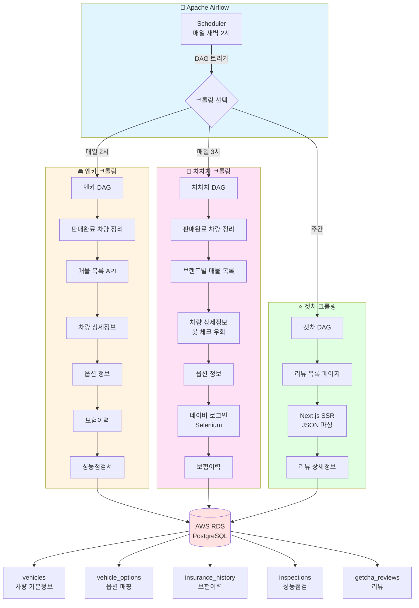

# 🚗 Car Fin - 중고차 데이터 크롤링 시스템

Airflow를 활용한 중고차 매물 및 리뷰 데이터 수집 자동화 시스템

## 📑 목차

- [프로젝트 개요](#-프로젝트-개요)
- [주요 기능](#-주요-기능)
- [기술 스택](#-기술-스택)
- [데이터 수집 플랫폼](#-데이터-수집-플랫폼)
- [시스템 아키텍처](#-시스템-아키텍처)
- [데이터 흐름도](#-데이터-흐름도)
- [프로젝트 구조](#-프로젝트-구조)
- [주요 트러블슈팅](#-주요-트러블슈팅)
  - [차차차 크롤링](#----차차차-크롤링----)
  - [엔카 크롤링](#----엔카-크롤링----)
  - [겟차 크롤링](#----겟차-크롤링----)
  - [Airflow](#----airflow----)

## 🎯 프로젝트 개요

**Car_Fin**은 국내 주요 중고차 플랫폼(엔카, KB 차차차)의 매물 정보와 차량 리뷰를 자동으로 수집하여 통합 데이터베이스를 구축하는 시스템입니다.

### 💡 핵심 가치

- **🔄 자동화:** Apache Airflow를 이용한 스케줄링으로 매일 자동 크롤링
- **📊 통합 데이터:** 다중 플랫폼의 데이터를 87개 표준화된 옵션으로 통합
- **🔍 상세 정보:** 차량 기본정보 + 옵션 + 보험이력 + 성능점검 (100+ 항목) + 리뷰
- **☁️ 클라우드 기반:** AWS RDS PostgreSQL을 이용한 안정적인 데이터 저장
- **🛡️ 봇 탐지 우회:** Selenium 기반 네이버 로그인 및 로봇 체크 통과

## ✨ 주요 기능

### 📋 크롤링 대상
- **엔카(Encar):** 매일 새벽 2시 - 차량정보 + 옵션 + 보험이력 + 성능점검
- **KB 차차차:** 매일 새벽 3시 - 차량정보 + 옵션 + 보험이력  
- **겟차(Getcha):** 매주 일요일 새벽 1시 - 차량 오너 리뷰

### 🚘 엔카 크롤러 (encar_crawler.py)
- ✅ 국산차/수입차 매물 정보 수집 (브랜드별, 모델그룹별)
- ✅ 차량 기본 정보: 가격, 주행거리, 연식, 색상 등
- ✅ **멀티스레드 크롤링:** 병렬 처리로 빠른 수집
- ✅ **CarSeq 중복 처리:** 실제 차량 ID 자동 대조
- ✅ **보험이력:** 사고이력, 특수용도, 소유자변경 등
- ✅ **성능점검서:** 엔진, 변속기, 외판/골격 상태 (100+ 항목)
- ✅ **판매완료 차량 자동 정리**

### 🏪 KB 차차차 크롤러 (chacha_crawler.py)
- ✅ 제조사별/클래스별 매물 정보 수집
- ✅ 차량 기본 정보 + 87개 표준 옵션
- ✅ **250페이지 제한 우회:** 차량명별 세분화 크롤링
- ✅ **봇 체크 우회:** Selenium으로 로봇 탐지 통과
- ✅ **네이버 SNS 로그인:** 보험이력 크롤링을 위한 자동 인증
- ✅ **세션 관리:** 쿠키 충돌 방지를 위한 세션 분리

### ⭐ 겟차 리뷰 크롤러 (getcha_crawler.py)
- ✅ 오너 리뷰 데이터 수집
- ✅ 평점 분석: 디자인, 성능, 옵션, 유지관리
- ✅ **Next.js SSR 파싱:** `__NEXT_DATA__` JSON 추출
- ✅ 제조사/모델별 사용자 의견 통계

### 🗄️ 데이터 통합
- ✅ **87개 표준 옵션:** 플랫폼별 옵션 코드 정규화
- ✅ **성능점검 통합:** 엔카/차차차 검사 항목 공통 스키마 변환
- ✅ **보험이력 통합:** 플랫폼별 다른 API 구조를 단일 테이블로 통합
- ✅ **외래키 CASCADE:** 차량 삭제 시 관련 데이터 자동 정리

## 🛠 기술 스택

### 워크플로우 & 오케스트레이션
- **Apache Airflow 3.1.0** - DAG 기반 작업 스케줄링 및 모니터링
- **CeleryExecutor** - 분산 작업 실행
- **Redis 7.2** - Celery 메시지 브로커

### 크롤링 & 데이터 수집
- **Python 3.13** - 메인 프로그래밍 언어
- **Requests** - HTTP 요청 처리
- **BeautifulSoup4 & lxml** - HTML 파싱
- **Selenium** - 동적 페이지 크롤링 및 브라우저 자동화
- **Chrome WebDriver** - 헤드리스 브라우저

### 데이터베이스 & ORM
- **PostgreSQL 16** - Airflow 메타데이터 저장
- **AWS RDS PostgreSQL 13+** - 크롤링 데이터 저장
- **SQLAlchemy** - ORM (Object-Relational Mapping)
- **psycopg2-binary** - PostgreSQL 어댑터

### 인프라 & 배포
- **Docker & Docker Compose** - 컨테이너화 및 오케스트레이션
- **AWS EC2** - 서버 호스팅
- **AWS RDS** - 관리형 데이터베이스

### 개발 도구
- **python-dotenv** - 환경변수 관리
- **Git** - 버전 관리

## 📡 데이터 수집 플랫폼

| 플랫폼 | 수집 데이터 | 크롤링 방식 | 주요 특징 | 크롤러 |
|--------|-------------|------------|-----------|--------|
| **엔카** | 차량 매물<br/>보험이력<br/>성능점검 | API 기반<br/>멀티스레드 | • 상세한 검사 정보 (100+ 항목)<br/>• CarSeq 중복 자동 처리<br/>• 판매완료 차량 정리 | `encar_crawler.py` |
| **KB 차차차** | 차량 매물<br/>보험이력 | HTML 파싱<br/>Selenium | • 봇 체크 우회 필요<br/>• 네이버 SNS 로그인<br/>• 250페이지 제한 대응 | `chacha_crawler.py` |
| **Getcha** | 오너 리뷰<br/>평점 | Next.js SSR<br/>JSON 파싱 | • `__NEXT_DATA__` 추출<br/>• 사용자 경험 데이터<br/>• 제조사/모델별 통계 | `getcha_crawler.py` |

### 플랫폼별 상세 정보

#### 🚘 엔카 (Encar)
```
수집 주기: 매일 새벽 2시
수집 방식: REST API (JSON)
처리 방식: 멀티스레드 (병렬 처리)
특이사항: 
  - CarSeq ID 중복 이슈 → 실제 ID 자동 대조
  - 판매완료 차량은 크롤링 전 자동 정리
  - 보험이력 및 성능점검서 API 별도 호출
```

#### 🏪 KB 차차차
```
수집 주기: 매일 새벽 3시
수집 방식: HTML 파싱 + Selenium
처리 방식: 순차 처리 (봇 탐지 회피)
특이사항:
  - 봇 체크 → 이미지 URL 없으면 Selenium으로 우회
  - 250페이지 제한 → 브랜드/차량명별 세분화
  - 보험이력 → 네이버 로그인 후 새 세션 생성
```

#### ⭐ Getcha (겟차)
```
수집 주기: 매주 일요일 새벽 1시
수집 방식: Next.js SSR 파싱
처리 방식: JSON 추출
특이사항:
  - __NEXT_DATA__ 스크립트에서 JSON 추출
  - 평점: 총점, 디자인, 성능, 옵션, 유지관리
  - 제조사/모델/등급별 사용자 의견 수집
```

## 🏗 시스템 아키텍처

```
┌─────────────────┐    ┌─────────────────┐    ┌─────────────────┐
│   Airflow UI    │    │   Scheduler     │    │   Worker        │
│   (Web UI)      │◄──►│   (DAG 실행)    │◄──►│   (크롤링)      │
└─────────────────┘    └─────────────────┘    └─────────────────┘
         │                       │                       │
         ▼                       ▼                       ▼
┌─────────────────┐    ┌─────────────────┐    ┌─────────────────┐
│   PostgreSQL    │    │     Redis       │    │   AWS RDS       │
│ (Airflow 메타)   │    │  (메시지 큐)     │    │ (크롤링 데이터)   │
└─────────────────┘    └─────────────────┘    └─────────────────┘
```

## 📊 데이터 흐름도




## 📁 프로젝트 구조

```
Car_Fin/
├── config/
│   └── airflow.cfg              # Airflow 설정 파일
├── crawler/
│   ├── encar_crawler.py         # 엔카 크롤러 (멀티스레드, CarSeq 중복 처리)
│   ├── chacha_crawler.py        # 차차차 크롤러 (봇 체크 우회, 세션 관리)
│   ├── getcha_crawler.py        # 겟차 크롤러 (Next.js SSR 파싱)
│   ├── finance_crawler.py       # 금융 정보 크롤러
│   ├── option_mapping.py        # 옵션 87개 표준화 매핑
│   └── inspection_mapping.py    # 차량 성능검사 항목 매핑
├── dags/
│   ├── encar_crawling_dag.py    # 엔카 크롤링 DAG (판매차량 정리 포함)
│   ├── chacha_crawling_dag.py   # 차차차 크롤링 DAG (외래키 CASCADE 처리)
│   └── getcha_review_dag.py     # 겟차 리뷰 DAG
├── db/
│   ├── connection.py            # DB 연결 (AWS RDS PostgreSQL)
│   └── model.py                 # SQLAlchemy 모델 (Vehicle, Option, Insurance 등)
├── docker-compose.yml           # Airflow 3.1.0 공식 이미지 + CeleryExecutor
├── requirements.txt             # Python 의존성
└── .env                         # 환경변수 (DB, JWT, 네이버 계정 등)
```

## 🐛 주요 트러블슈팅

### ---- 차차차 크롤링 ----

#### 1️⃣ **봇 체크로 인한 간이 페이지 응답**

**문제 상황:**  
KB 차차차 크롤링 시 어떤 페이지는 이미지 주소를 정상적으로 가져오지만, 어떤 페이지는 이미지 URL이 없는 간이 페이지를 응답받음

**원인:**  
봇 여부 체크를 통해 간이 페이지를 제공하는 경우 발생

**시도한 방법들:**
```
1. 딜레이 증가 (time.sleep 늘림)           → ❌ 해결 안됨
2. 재시도 2~3회 반복                       → ❌ 해결 안됨  
3. 모바일 페이지로 우회                     → △ 일부 해결, 하지만 시간 오래걸리고,여전히 걸리는게 있음.
```

**✅ 최종 해결 방법:**
```python
# 이미지 URL이 없을 때만 셀레니움으로 로봇 체크 통과
def crawl_with_bot_check_bypass(vehicle_url):
    # 1. 일반 requests로 먼저 시도
    html = requests.get(vehicle_url).text
    images = parse_images(html)
    
    # 2. 이미지 URL이 없으면 → 간이 페이지 판단
    if not images:
        # 셀레니움으로 로봇 체크 통과
        driver = webdriver.Chrome()
        driver.get(vehicle_url)
        time.sleep(2)  # 로봇 체크 통과 대기
        
        # 셀레니움 쿠키를 세션에 업데이트
        selenium_cookies = driver.get_cookies()
        for cookie in selenium_cookies:
            session.cookies.set(cookie['name'], cookie['value'])
        
        driver.quit()
        
        # 3. 쿠키 업데이트 후 다시 크롤링 재개
        html = session.get(vehicle_url).text
        images = parse_images(html)
    
    return images
```

**핵심 포인트:**
- 모든 요청마다 셀레니움을 쓰면 시간이 너무 오래 걸림
- 이미지 URL 유무로 간이 페이지 판단 → 그때만 셀레니움 사용
- 셀레니움의 쿠키를 세션에 업데이트하여 이후 요청은 일반 requests 사용

---

#### 2️⃣ **250페이지 제한 & 160페이지 간이페이지 전환**

**문제 상황:**  
- 차차차 사이트는 250페이지까지만 응답
- 160페이지 이후부터는 간이페이지로 전환되어 파싱 실패

**✅ 해결 방법:**
```python
def crawl_chacha_with_pagination_split():
    """브랜드별로 분할하여 크롤링"""
    brands = get_all_brands()
    
    for brand in brands:
        total_pages = get_brand_total_pages(brand)
        
        # 250페이지 미만이면 그대로 크롤링
        if total_pages < 250:
            crawl_brand(brand, pages=total_pages)
        
        # 250페이지 이상이면 차량 네임별로 세분화
        else:
            car_names = get_car_names_by_brand(brand)
            for car_name in car_names:
                crawl_by_car_name(brand, car_name)
        
        # 160페이지 이후 간이페이지 대응
        if current_page > 160:
            # 간이페이지 양식에 맞게 파싱 로직 변경
            html = get_simple_page(url)
            parse_simple_format(html)
```

**핵심 포인트:**
- 250페이지 제한 → 브랜드별/차량네임별 분할 크롤링
- 160페이지 이후 → 간이페이지 전용 파싱 로직 준비

---

#### 3️⃣ **옵션 크롤링 일반화의 어려움**

**문제 상황:**  
KB 차차차와 엔카의 옵션 명칭이 달라서 일반화 작업이 필요

**작업 내역:**
```
공통 옵션: 59개
  - 에어백, 크루즈컨트롤, 후방카메라, LED램프 등

KB 차차차 전용: 14개
  - SUNROOF_PANORAMA, MIRROR_TURN_SIGNAL, MIRROR_REVERSE_TILT
  - HIGH_BEAM_ASSIST, ADAPTIVE_HEADLIGHT, AEB, FRONT_CAMERA
  - ACTIVE_HEADREST, AUTO_PARKING, LKAS, FCW, HAS
  - AIRBAG_KNEE, SAFETY_WINDOW, NAVIGATION_AFTERMARKET

엔카 전용: 14개
  - GHOST_DOOR, ROOF_RACK, POWER_DOORLOCK, POWER_WINDOW
  - POWER_STEERING, CURTAIN_REAR_SEAT, CURTAIN_REAR
  - WIRELESS_DOORLOCK, RAIN_SENSOR, AUTO_LIGHT
  - FRONT_AV_MONITOR, REAR_AV_MONITOR, CD_PLAYER, USB_PORT, AUX_PORT

총 87개 옵션으로 표준화
```

**✅ 매핑 예시 (`option_mapping.py`):**
```python
# KB 차차차 → 표준 옵션
CHACHA_OPTION_MAP = {
    '파노라마 선루프': 'SUNROOF_PANORAMA',
    '후측방 경보': 'BSD',
    '전방 추돌방지': 'AEB',
    # ... 87개 매핑
}

# 엔카 → 표준 옵션
ENCAR_OPTION_MAP = {
    '유령문': 'GHOST_DOOR',
    '루프랙': 'ROOF_RACK',
    '파워 도어락': 'POWER_DOORLOCK',
    # ... 87개 매핑
}
```

**가장 어려웠던 부분:**
1. **항목 불일치** - 사이트마다 옵션 명칭이 다름
2. **데이터 형식 불일치** - boolean vs 문자열 vs null
3. **항목 세분화** - 차량 성능검사 항목이 너무 세분화됨

**소요 시간:** 일일이 응답값을 뒤져보고 정리하는데 가장 오래 걸림

---

#### 4️⃣ **보험이력 크롤링 세션 충돌**

**문제 상황:**  
- 상세페이지 접근 시 로봇 체크 통과 후 쿠키 저장
- 보험이력 조회 시 네이버 로그인 후 다시 쿠키 추출
- 세션 정보 충돌로 **차량 정보는 추출되지만 보험이력 안 됨** (또는 그 반대)

**원인:**  
하나의 세션에 두 가지 쿠키(로봇 체크 통과 + 네이버 로그인)를 섞어서 사용하면 충돌 발생

**✅ 해결 방법:**
```python
def get_vehicle_with_insurance():
    # 1. 차량 정보 크롤링 (로봇 체크 통과 쿠키 사용)
    vehicle_session = requests.Session()
    selenium_cookies = bypass_bot_check()
    vehicle_session.cookies.update(selenium_cookies)
    vehicle_info = crawl_vehicle_info(vehicle_session)
    
    # 2. 보험이력은 새로운 세션으로 크롤링
    insurance_session = requests.Session()
    naver_cookies = login_naver_with_selenium()
    insurance_session.cookies.update(naver_cookies)
    insurance_history = crawl_insurance(insurance_session)
    
    return {
        'vehicle': vehicle_info,
        'insurance': insurance_history
    }
```

**핵심 포인트:**
- 세션을 아예 분리하여 쿠키 충돌 방지
- 셀레니움의 원본 쿠키를 그대로 가져와서 적용

---

### ---- 엔카 크롤링 ----

#### 1️⃣ **중복되는 CarSeq 처리**

**문제 상황:**  
- 엔카는 내부적으로 차량을 식별하는 `carseq` ID를 사용
- 그런데 같은 차량을 가리키는 여러 `carseq`가 존재
- 예: `carseq=12345`로 요청 → 실제 응답에는 `carseq=67890`이 나옴

**추가 문제:**
```python
# DB에서 가져온 값: int 타입
db_carseq = 12345  # int

# API 응답값: str 타입
api_carseq = "12345"  # str

# 중복 체크 실패!
if db_carseq in existing_carseqs:  # False (타입이 달라서)
```

**✅ 해결 방법:**
```python
def get_real_carseq(original_carseq):
    """상세조회 API로 실제 carseq 확인"""
    response = requests.get(f'/api/detail/{original_carseq}')
    data = response.json()
    real_carseq = data.get('carseq')
    
    # 실제 carseq가 다르면 교체
    return real_carseq if real_carseq != original_carseq else original_carseq

def crawl_encar():
    # 기존 DB의 carseq를 str로 통일
    existing_carseqs = {str(c) for c in get_existing_carseqs_from_db()}
    
    for carseq in carseq_list:
        # 실제 carseq 확인
        real_carseq = str(get_real_carseq(carseq))
        
        # 중복 체크
        if real_carseq in existing_carseqs:
            continue  # 이미 수집한 차량
        
        # 크롤링 진행
        vehicle = crawl_vehicle(real_carseq)
        existing_carseqs.add(real_carseq)
```

**핵심 포인트:**
- 상세조회 API로 실제 carseq 대조
- 타입을 str로 통일하여 중복 체크

---

#### 2️⃣ **멀티스레드로 인한 중복 차량번호**

**문제 상황:**  
```
페이지 1: 차량번호 "12가3456" 크롤링 중...
페이지 5: 차량번호 "12가3456" 크롤링 중...  (동시 진행)

→ 둘 다 중복 체크 통과 (동시에 체크해서 아직 DB에 없다고 판단)
→ DB 삽입 시 유일성 제약조건 위반!
```

**원인:**  
멀티스레드로 병렬 크롤링 시 동시에 중복된 차량번호를 크롤링하여 충돌

**✅ 해결 방법:**
```python
from concurrent.futures import ThreadPoolExecutor
from threading import Lock

def crawl_encar_with_thread_safe():
    collected_vehicles = []
    lock = Lock()
    
    def crawl_page(page_num):
        vehicles = crawl_single_page(page_num)
        with lock:
            collected_vehicles.extend(vehicles)
    
    # 멀티스레드로 병렬 크롤링
    with ThreadPoolExecutor(max_workers=5) as executor:
        executor.map(crawl_page, range(1, 100))
    
    # DB 삽입 전 중복 제거
    unique_vehicles = remove_duplicates_by_car_number(collected_vehicles)
    
    # 한번에 DB 삽입
    insert_to_db(unique_vehicles)

def remove_duplicates_by_car_number(vehicles):
    """차량번호 기준으로 중복 제거"""
    seen = set()
    unique = []
    for v in vehicles:
        if v['car_number'] not in seen:
            seen.add(v['car_number'])
            unique.append(v)
    return unique
```

**핵심 포인트:**
- 병렬로 크롤링하되, DB 삽입 전 모아서 중복 제거
- Lock으로 리스트 접근 동기화

---

#### 3️⃣ **판매/삭제된 차량 처리**

**문제 상황:**  
- 엔카 API로 차량 정보 요청 시 응답 없음 (404 또는 빈 응답)
- 알고보니 이미 판매되었거나 삭제된 매물

**고려한 방법:**
```
1. 판매/삭제된 차량은 바로바로 DB에서 삭제
   → ✅ 선택! (현재 프로젝트에서는 이력 추적 불필요)

2. status 컬럼 추가 (active/sold/deleted)
   → ❌ 데이터 분석용으로 쓸 계획 없어서 보류
```

**✅ 해결 방법:**
```python
def cleanup_sold_vehicles():
    """크롤링 전 판매완료 차량 정리"""
    print("[엔카] 판매완료 차량 정리 시작...")
    
    # 1. DB에 저장된 모든 carseq 가져오기
    existing_carseqs = get_all_carseqs_from_db()
    
    # 2. API로 각 차량 상태 확인
    sold_count = 0
    for carseq in existing_carseqs:
        response = requests.get(f'/api/detail/{carseq}')
        
        # 응답 없음 = 판매완료
        if response.status_code == 404 or not response.json():
            delete_vehicle_cascade(carseq)  # CASCADE 삭제
            sold_count += 1
    
    print(f"[엔카] 판매완료 차량 {sold_count}건 삭제 완료")

# DAG에서 크롤링 전에 먼저 실행
def encar_crawling_dag():
    cleanup_sold_vehicles()  # 1단계: 정리
    crawl_encar()            # 2단계: 크롤링
```

**핵심 포인트:**
- 크롤링 전에 먼저 판매완료 차량 정리
- 외래키 CASCADE 설정으로 관련 데이터도 자동 삭제

---

### ---- 겟차 크롤링 ----

#### **Next.js SSR 사이트 크롤링**

**문제 상황:**  
- 겟차는 Next.js로 만들어진 SSR 사이트
- 일반적인 HTML 파싱으로는 데이터를 가져올 수 없음

**특징:**  
HTML 하단 `<script>` 태그에 JSON 데이터가 포함되어 있음

**✅ 해결 방법:**
```python
from bs4 import BeautifulSoup
import json

def crawl_getcha_reviews():
    """Next.js SSR 사이트 크롤링"""
    url = 'https://getcha.io/review/list'
    html = requests.get(url).text
    soup = BeautifulSoup(html, 'html.parser')
    
    # 1. <script type="application/json"> 태그 찾기
    script_tag = soup.find('script', {'id': '__NEXT_DATA__', 'type': 'application/json'})
    
    if not script_tag:
        raise Exception("Next.js 데이터를 찾을 수 없습니다")
    
    # 2. JSON 파싱
    json_data = json.loads(script_tag.string)
    
    # 3. 실제 데이터는 props 안에 있음
    reviews = json_data['props']['pageProps']['reviews']
    
    # 4. 데이터 추출
    for review in reviews:
        car_name = review['carName']
        rating = review['rating']
        content = review['content']
        # ... DB 저장
    
    return reviews
```

**핵심 포인트:**
- HTML → JSON 2단계 파싱 필요
- `__NEXT_DATA__` 스크립트 태그가 핵심
- SSR이라도 클라이언트에 JSON 데이터를 내려줌

---

### ---- Airflow ----

#### 1️⃣ **FabAuthManager + Python 3.13 호환성 이슈**

**문제 상황:**  
- 초기에 SimpleAuthManager로 개발 → 개발용으로만 간단하고 배포용으로는 권장되지 않음
- FabAuthManager로 변경 시도
- **첫 번째 에러:** `ModuleNotFoundError: No module named 'airflow.providers.fab'`
  - 공식 이미지에 FAB가 포함되어 있을 거라 생각했고 공식문서에 그렇게 되어 있다는 걸 찾음 하지만만...
  - **Airflow 3.0부터 FAB Provider가 별도 패키지로 분리됨!**
  - 결국 다른 공식문서에서 별로 분리되었다는 걸 확인함. 그래서 추가 설치했지만,

- **두 번째 에러 (Python 3.13):** `ModuleNotFoundError: No module named 'connexion'`
  - FAB Provider 설치했는데도 에러 발생
  - `apache/airflow:3.1.0-python3.13` (최신) 사용 시

**원인 분석:**
```python
# 1. Airflow 3.0+ 변경사항
- SimpleAuthManager: 기본 포함 (단순한 인증만)
- FabAuthManager: 별도 설치 필요 (RBAC, 사용자 관리)
  → apache-airflow-providers-fab 패키지 설치 필수!

# 2. Python 3.13 호환성 문제
# apache-airflow-providers-fab 3.0.0 요구사항 (PyPI)
connexion[flask]>=2.14.2,<3.0  # Python 3.13 미만만 지원
flask>=2.2.1,<2.3              # Python 3.13 미만만 지원
flask-appbuilder==4.6.3        # Python 3.13 미만만 지원
```
→ **FAB Provider가 Python 3.13을 아직 완전히 지원하지 않음**

**시도한 방법:**
```
1. 공식 이미지만 사용 (FAB 자동 포함될 것으로 예상)
   → ❌ ModuleNotFoundError: airflow.providers.fab
   → 공식 문서 혼란: "기본 포함"이라 했지만 실제로는 별도 설치 필요

2. Airflow 3.0.6 + 이미 만들어진 docker-compose 사용
   → ❌ 최신 버전(3.1.0) 사용하고 싶어서 포기

3. Python 3.13 + apache-airflow-providers-fab 설치
   → ❌ ModuleNotFoundError: connexion
   → Flask, Flask-AppBuilder 등 종속성 충돌

4. requirements.txt에 connexion, Flask 등 수동 추가
   → ❌ 다른 종속성과 버전 충돌 계속 발생

5. Python 3.12 (기본 설정) + FAB Provider + Constraints
   → ✅ 해결! 모든 종속성 자동 설치됨
```

**✅ 최종 해결 방법:**
```dockerfile
# Dockerfile - Python 3.12 기본 이미지 사용
FROM apache/airflow:3.1.0  # Python 3.12 (기본)

USER root
# Chrome 등 OS 패키지 설치...

USER airflow
ARG AIRFLOW_VERSION=3.1.0
COPY requirements.txt /requirements.txt
RUN pip install --no-cache-dir \
    -r /requirements.txt \
    --constraint "https://raw.githubusercontent.com/apache/airflow/constraints-${AIRFLOW_VERSION}/constraints-3.12.txt"
```

```txt
# requirements.txt - FAB Provider 명시적 설치
apache-airflow-providers-fab>=1.4.0  # 종속성 자동 설치됨
requests>=2.31.0
selenium>=4.15.0
...
```


**핵심 교훈:**
- ⚠️ **Airflow 3.0+ 주의사항: FAB Provider는 별도 설치 필요!**
  - 공식 문서가 명확하지 않음 (AIRFLOW_EXTRAS에 fab 포함이라 했지만...)
  - 실제로는 `apache-airflow-providers-fab` 직접 설치해야 함
  
- ⚠️ **무조건 최신보다 호환성 검증된 기본 설정 우선**
  - Python 3.13 (최신) → 종속성 충돌
  - Python 3.12 (기본) → 모든 종속성 자동 해결
  
- ✅ **Constraints 파일 필수** (Airflow 팀이 검증한 버전 조합)
- ✅ **Dockerfile 빌드 방식** (런타임 `_PIP_ADDITIONAL_REQUIREMENTS`는 개발용만)
- ✅ **공식 이미지 기반 + 필요한 Provider만 추가**

---

#### 2️⃣ **JWT 인증 토큰 오류**

**문제 상황:**  
Airflow 3.x부터는 컴포넌트가 분리됨 (Scheduler, API Server, Worker 등)

**공식 문서:**  
> "JWT 시크릿을 빈 문자열로 설정하면 자동으로 생성됩니다"

**실제로는:**  
```
API Server: JWT 토큰 A 생성
Scheduler:  JWT 토큰 B 생성
Worker:     JWT 토큰 C 생성

→ 서로 다른 토큰이라 통신 실패!
```

**에러 로그:**
```
[error] Invalid auth token: Signature verification failed
[warning] api_auth/jwt_secret was empty
```

**✅ 해결 방법:**
```bash
# .env 파일
AIRFLOW__CORE__FERNET_KEY=your_fernet_key_here
AIRFLOW__API_AUTH__JWT_SECRET=your_jwt_secret_here

# 키 생성 방법
python -c "from cryptography.fernet import Fernet; print(Fernet.generate_key().decode())"
python -c "import secrets; print(secrets.token_urlsafe(32))"
```

```yaml
# docker-compose.yml
environment:
  AIRFLOW__CORE__FERNET_KEY: ${AIRFLOW__CORE__FERNET_KEY:-}
  AIRFLOW__API_AUTH__JWT_SECRET: ${AIRFLOW__API_AUTH__JWT_SECRET:-}
```

**핵심 포인트:**
- JWT 시크릿을 고정해서 모든 컴포넌트가 동일한 키 사용
- `.env` 파일에 저장하여 보안 유지
- `${VAR:-}` 문법으로 환경변수 주입

---

#### 3️⃣ **Triggerer 컴포넌트 부재**

**문제 상황:**  
- 초기에는 최소 컴포넌트만 실행 (API Server + Scheduler)
- DAG 실행이 실패하거나 재시도가 필요할 때 제대로 작동하지 않음

**Triggerer의 역할:**
- 실패한 Task의 재시도 스케줄링
- Sensor 작업의 비동기 대기
- 지연된 작업의 트리거링

**✅ 해결 방법:**
```yaml
# docker-compose.yml
services:
  # 공식 문서 참고하여 필수 컴포넌트 모두 추가
  airflow-apiserver:      # API 서버
  airflow-scheduler:       # DAG 스케줄러
  airflow-triggerer:       # 재시도 & 지연 작업 트리거
  airflow-dag-processor:   # DAG 파일 파싱
  airflow-worker:          # 실제 작업 실행
```

**핵심 포인트:**
- Triggerer 없으면 재시도 로직이 제대로 작동 안 함
- 공식 문서의 권장 구성대로 모든 컴포넌트 실행

---

## 📌 기억할 점

### Airflow 운영
- **환경변수 관리:** `env_file` 명시적 설정 필수
- **패키지 의존성:** 공식 이미지 + 추가 패키지만 설치
- **JWT 인증:** 모든 컴포넌트가 동일한 JWT 시크릿 사용
- **서비스 의존성:** 모든 컴포넌트가 정상 작동해야 DAG 실행 가능

### 크롤링 최적화
- **메모리 관리:** 멀티스레드 시 수집 후 일괄 처리
- **세션 재사용:** 쿠키 충돌 방지를 위해 용도별 세션 분리
- **봇 체크:** 필요한 경우에만 셀레니움 사용

---

## 🚀 AWS 자동 배포

### 1. AWS 설정

#### ECR 리포지토리 생성
```bash
aws ecr create-repository --repository-name car-fin-airflow --region ap-northeast-2
```

#### EC2 초기 설정
```bash
# Docker 설치
sudo yum install -y docker
sudo systemctl start docker
sudo usermod -aG docker ec2-user

# Docker Compose 설치
sudo curl -L "https://github.com/docker/compose/releases/latest/download/docker-compose-$(uname -s)-$(uname -m)" -o /usr/local/bin/docker-compose
sudo chmod +x /usr/local/bin/docker-compose

# 프로젝트 클론
git clone https://github.com/YOUR_USERNAME/Car_Fin.git ~/Car_Fin
cd ~/Car_Fin

# 환경변수 설정
cp env.example .env
# .env 파일 편집 (DB, ECR 정보 입력)
```

### 2. GitHub Secrets 설정

GitHub 리포지토리 → Settings → Secrets → 5가지 추가:

1. **`AWS_ACCESS_KEY_ID`**: IAM 액세스 키
2. **`AWS_SECRET_ACCESS_KEY`**: IAM 시크릿 키
3. **`ECR_REPOSITORY_NAME`**: `car-fin-airflow`
4. **`EC2_HOST`**: EC2 퍼블릭 IP
5. **`EC2_USER`**: `ec2-user` (Amazon Linux) 또는 `ubuntu`

### 3. 자동 배포 실행

```bash
git add .
git commit -m "feat: 새 기능 추가"
git push origin main
```

GitHub Actions가 자동으로:
1. Docker 이미지 빌드
2. ECR에 업로드
3. EC2에서 최신 이미지 pull & 재시작

---